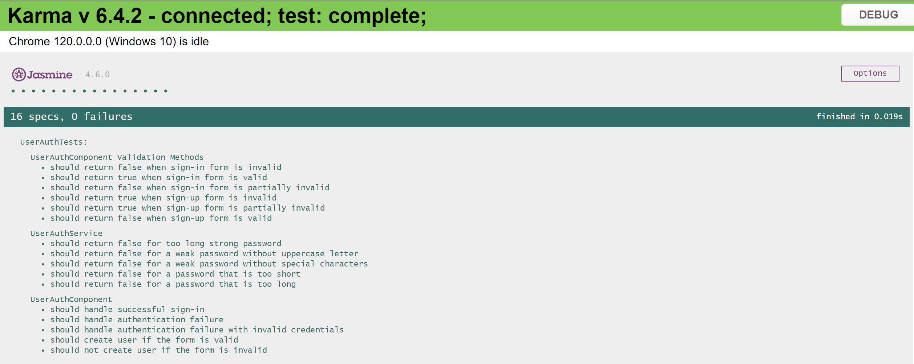
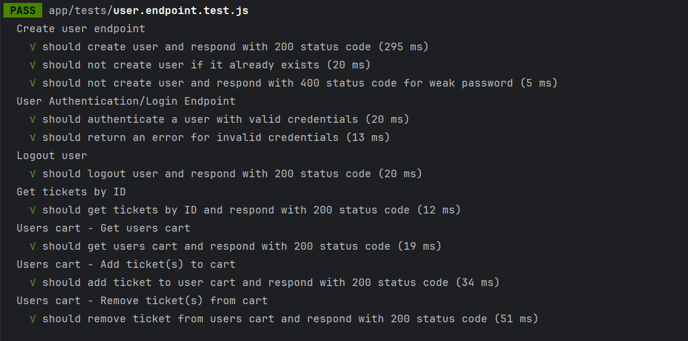

# Nazwa kursu
Testowanie i Jakość Oprogramowania (Projekt)

# Autor
Marcin Król

# Temat projektu
Aplikacja do sprzedaży biletów

# Opis projektu
Projekt skupia się na przeprowadzeniu i implementacji testów logowania użytkownika do systemu oraz na innych funkcjonalnościach modułu użytkownika.

# Uruchomienie projektu
Aby, uruchomić projekt należy znajdować się w terminalu w odpowiednim folderze(ścieżce) i wywołać komendę '_npm start_' zarówno dla części serwerowej(backend) jak 
i klienckiej(frontend).

Ścieżka części serwerowej: <..\TIJO-Projekt\Server>
Ścieżka części frontendowej: <..\TIJO-Projekt\App>

# Uruchomienie testów jednostkowych
Aby, uruchomić testy jednostkowe należy z poziomu ścieżki <..\TIJO-Projekt\App> uruchomić komendę: ng test --include='**/user-auth.component.spec.ts'.

Testy jednostkowe skupiają się na kwestii poprawności działania części frontendowej. W szczególności metod związanych z poprawną weryfikacją pól formularza oraz wywoływaniem metod odpowiedzialnych za tworzenie nowych kont oraz logowanie. Testy jednostkowe zostały podzielone na 3. grupy.

Spis testów jednostkowych:
## Spis testów
### UserAuthComponent Validation Methods
| Lp. | Test                                             | Oczekiwany rezultat                                                                                   |
|-----|--------------------------------------------------|--------------------------------------------------------------------------------------------------------|
| 1   | should return false when **sign-in** form is invalid | Zwraca wartość `false` gdy formularz logowania jest nieprawidłowy.                                      |
| 2   | should return false when **sign-in** form is partially invalid | Zwraca wartość `false` gdy formularz logowania jest częściowo nieprawidłowy.                      |
| 3   | should return true when **sign-in** form is valid    | Zwraca wartość `true` gdy formularz logowania jest poprawny.                                           |
| 4   | should return true when **sign-up** form is invalid   | Zwraca wartość `true` gdy formularz rejestracji jest nieprawidłowy.                                     |
| 5   | should return true when **sign-up** form is partially invalid | Zwraca wartość `true` gdy formularz rejestracji jest częściowo nieprawidłowy.                      |
| 6   | should return false when **sign-up** form is valid     | Zwraca wartość `false` gdy formularz rejestracji jest poprawny.                                          |

### UserAuthService
| Lp. | Test                                             | Oczekiwany rezultat                                                                                   |
|-----|--------------------------------------------------|--------------------------------------------------------------------------------------------------------|
| 1   | should return false for too long strong password  | Zwraca wartość `false` dla zbyt długiego silnego hasła.                                                  |
| 2   | should return false for a weak password without uppercase letter | Zwraca wartość `false` dla słabego hasła bez wielkiej litery.                            |
| 3   | should return false for a weak password without special characters | Zwraca wartość `false` dla słabego hasła bez znaków specjalnych.                          |
| 4   | should return false for a password that is too short | Zwraca wartość `false` dla zbyt krótkiego hasła.                                                        |
| 5   | should return false for a password that is too long | Zwraca wartość `false` dla zbyt długiego hasła.                                                         |

### UserAuthComponent
| Lp. | Test                                             | Oczekiwany rezultat                                                                                   |
|-----|--------------------------------------------------|--------------------------------------------------------------------------------------------------------|
| 1   | should handle successful sign-in                 | Poprawna obsługa udanego logowania.                                                                    |
| 2   | should handle authentication failure             | Obsługa błędu uwierzytelniania.                                                                        |
| 3   | should handle authentication failure with invalid credentials | Obsługa błędu uwierzytelniania z nieprawidłowymi danymi.                                     |
| 4   | should create user if the form is valid         | Utworzenie użytkownika przy prawidłowo wypełnionym formularzu.                                       |
| 5   | should not create user if the form is invalid   | Brak utworzenia użytkownika przy nieprawidłowo wypełnionym formularzu.                                |
### Screen z przebiegu testów

# Uruchomienie testów integracyjnych
Aby, uruchomić testy integracyjne należy z poziomu ścieżki <..\TIJO-Projekt\Server> uruchomić komendę: npm test

Testy integracyjne skupiają się na kwestii poprawności działania części backendowej, a dokładniej poprawności działania modułów między sobą.

Spis testów integracyjnych:
### Create user endpoint
| Lp. | Test                                                              | Oczekiwany rezultat                                                              |
|-----|-------------------------------------------------------------------|-----------------------------------------------------------------------------------|
| 1   | should create user and respond with 200 status code   | Użytkownik zostaje utworzony, a serwer odpowiada z kodem stanu 200.         |
| 2   | should not create user if it already exists           | Użytkownik nie zostaje utworzony, jeśli już istnieje.       |
| 3   | should not create user and respond with 400 status code.  | Użytkownik nie zostaje utworzony i serwer odpowiada z kodem stanu 400.              |

### Screen z przebiegu testów

# Scenariusze testowe dla testera manualnego
| Lp. | Nazwa                                                 | Warunki wstępne                                            | Kroki wykonania                                                                      | Oczekiwany rezultat                                                                                      |
|-----|--------------------------------------------------------|-------------------------------------------------------------|--------------------------------------------------------------------------------------|----------------------------------------------------------------------------------------------------------|
| 1   | Otwarcie strony logowania                              | Dostęp do strony logowania                                  | 1. Kliknij w ikonę awatara w menu nawigacyjnym.   2. Kliknij w rozsuwanym menu przycisk "Zaloguj"                                            | Strona logowania poprawnie się otwiera.                                                                  |
| 2   | Otwarcie strony rejestracji                            | Dostęp do strony rejestracji                                | 1. Kliknij w ikonę awatara w menu nawigacyjnym.   2. Kliknij w rozsuwanym menu przycisk "Zarejestruj się"                                                      | Strona rejestracji poprawnie się otwiera.                                                                |
| 3   | Przejście między formularzami logowania i rejestracji  | Strona logowania lub rejestracji jest już otwarta           | 1. Kliknij przycisk "Zarejestruj się" mając otwarty panel logowania lub przycisk "Zaloguj się" mając otwarty panel rejestracji          | Animacja przenoszenia panelu działa, formularze logowania i rejestracji są widoczne po zmianie.          |
| 4   | Logowanie poprzez wprowadzenie poprawnych danych       | Strona logowania jest już otwarta                           | 1. Wypełnij prawdiłowo wszystkie pola formularza.   2. Kliknij przycisk "Zaloguj się".              | Użytkownik zostaje poprawnie zalogowany.                                                                 |
| 5   | Zabezpieczenie przed nieprawidłowymi danymi logowania | Strona logowania jest już otwarta                           | 1. Wprowadź niepoprawne dane logowania.   2. Kliknij przycisk "Zaloguj się".                        | Formularz nie pozwala na zalogowanie z nieprawidłowymi danymi.                                             |
| 6   | Rejestracja użytkownika z poprawnymi danymi           | Strona rejestracji jest już otwarta                         | 1. Wypełnij formularz rejestracyjny poprawnymi danymi.   2. Kliknij przycisk "Zarejestruj się".     | Użytkownik zostaje pomyślnie zarejestrowany. System tworzy nowe konto w bazie danych. System wyświetla monit o utworzeniu konta.                                                             |
| 7   | Zabezpieczenie przed nieprawidłowymi danymi rejestracyjnymi | Strona rejestracji jest już otwarta                   | 1. Wypełnij formularz rejestracyjny nieprawidłowymi danymi.   2. Kliknij przycisk "Zarejestruj się". | Formularz nie pozwala na rejestrację z nieprawidłowymi danymi.                                             |
| 8   | Sprawdzenie unikalności nazwy użytkownika              | Formularz rejestracji i próba utworzenia konta           | 1. Próba utworzenia konta z istniejącą już nazwą użytkownika.                        | System wyświetla odpowiednie ostrzeżenie o niedostępności nazwy użytkownika.                               |
| 9   | Wylogowanie użytkownika                                | Użytkownik jest zalogowany                                 | 1. Zaloguj się na konto użytkownika.   2. Kliknij w ikonę awatara w menu nawigacyjnym.   3. Kliknij w rozsuwanym menu przycisk wylogowania.                      | Użytkownik jest poprawnie wylogowany i panel logowania jest ponownie dostępny.                            |
| 10  | Sprawdzenie reakcji formularza na puste pole          | Formularz logowania lub rejestracji posiada puste pola     | 1. Pozostaw jedno z pól formularza pustym, np. pole loginu lub hasła.   2. Kliknij przycisk "Zaloguj się". | Formularz informuje użytkownika o konieczności wypełnienia wszystkich pól lub blokuje wysłanie danych.  |

# Dokumentacja API
Szczegółowa dokumentacja API dostępna jest z poziomu interfejsu swagger.io. Po włączeniu serwera (<..\TIJO-Projekt\Server>npm start) dokumentację można znaleźć pod adresem: http://localhost:3001/api-docs/#/.

### Alternatywnie. Dokumentacja swagger'a w .yaml
[Link to Swagger YAML File](./Sources/swagger.yaml)

# Technologie użyte w projekcie
- node.js
- express.js
- swagger.io
- angular 16
- mongo.db

# Prezentacja aplikacji
https://youtu.be/TaqddrTQ0sc
